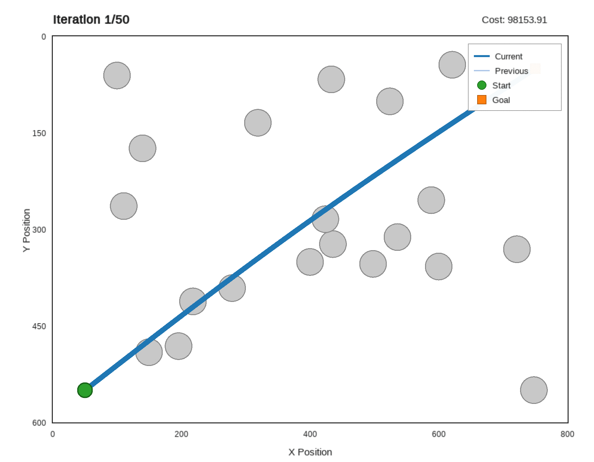
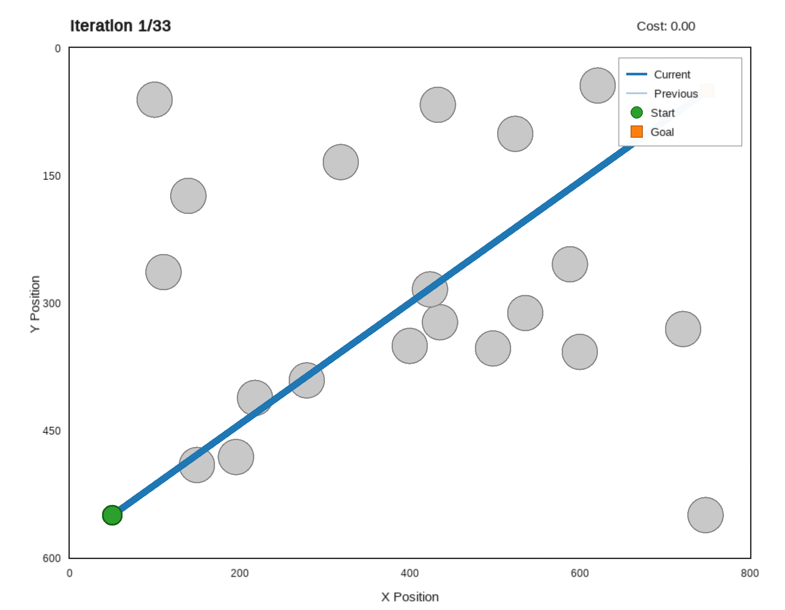
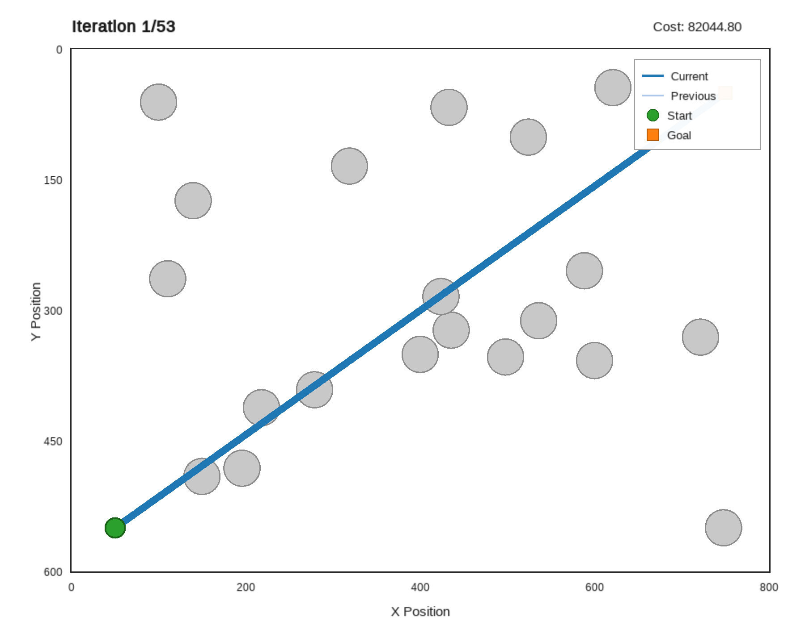
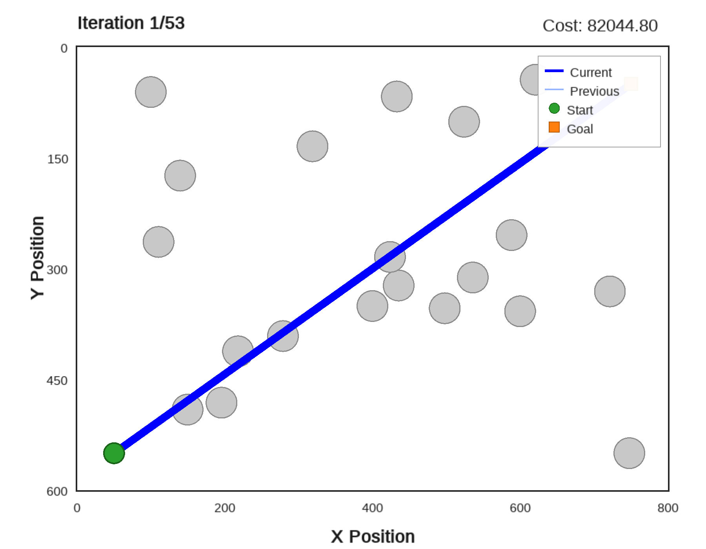
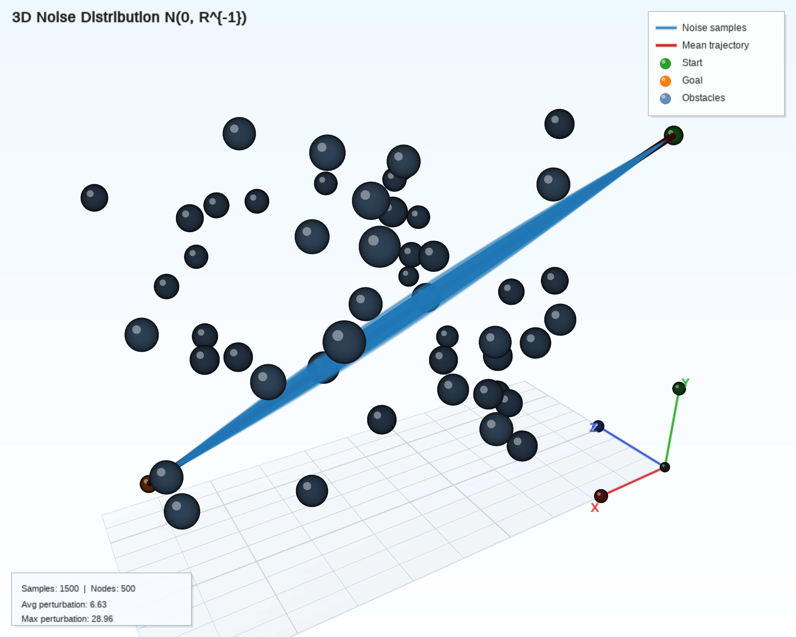

# ProxCEMP: Proximal Cross-Entropy Motion Planning

A high-performance C++ library for sampling-based trajectory optimization, featuring gradient-free algorithms for collision-free motion planning in *N*-dimensional configuration spaces.

---

## Table of Contents

- [Overview](#overview)
- [Installation](#installation)
- [Quick Start](#quick-start)
- [Examples](#examples)
- [Algorithm Details](#algorithm-details)
- [Configuration Reference](#configuration-reference)
- [Project Structure](#project-structure)
- [Citation](#citation)
- [License](#license)
- [Related Work](#related-work)

---

## Overview

ProxCEMP provides efficient, gradient-free optimization methods for trajectory planning in cluttered environments. The library implements a task-based architecture that cleanly separates optimization algorithms from problem-specific cost computations, enabling straightforward extension to new robot platforms and planning scenarios.

### Key Features

| Category | Features |
|----------|----------|
| **Algorithms** | Proximal Cross-Entropy Method (PCE), Natural Gradient Descent (NGD), STOMP, CasADi-based solvers |
| **Architecture** | Task-based design, header-only core, *N*-dimensional support, pluggable forward kinematics |
| **Collision Avoidance** | SDF-based detection, configurable safety margins, *N*-dimensional obstacles |
| **Trajectory Quality** | Smoothness optimization, configurable discretization, start/goal constraints |

---

## Installation

### Prerequisites

| Dependency | Version | Required |
|------------|---------|----------|
| C++ Compiler | C++17 (GCC 7+, Clang 5+, MSVC 2017+) | ✓ |
| CMake | 3.10+ | ✓ |
| Eigen3 | 3.3+ | ✓ |
| yaml-cpp | — | Optional |
| SFML | 3.0+ | Optional (visualization) |
| GoogleTest | — | Optional (testing) |
| nlohmann/json | 3.0+ | Optional (serialization) |

### Ubuntu/Debian

```bash
# Install dependencies
sudo apt-get update
sudo apt-get install -y \
    build-essential cmake libeigen3-dev \
    libyaml-cpp-dev libsfml-dev libgtest-dev nlohmann-json3-dev

# Clone and build
git clone --recurse-submodules https://github.com/hzyu17/ProxCEMP.git
cd ProxCEMP && mkdir build && cd build
cmake .. && make && sudo make install
```

To enable AddressSanitizer for the STOMP planner, use the following flag:

```bash
cmake -DENABLE_STOMP_ASAN=ON ..
```

### macOS

```bash
# Install dependencies
brew install cmake eigen yaml-cpp sfml googletest nlohmann-json

# Clone and build
git clone --recurse-submodules https://github.com/hzyu17/ProxCEMP.git
cd ProxCEMP && mkdir build && cd build
cmake .. && make && sudo make install
```

---

## Quick Start

### Building Examples

```bash
cd Examples2d3d && mkdir build && cd build
cmake .. && make

# Run examples
./main                          # Compare optimization algorithms
./visualize_collision_checking  # Interactive collision visualization
./visualize_noisy_trj           # Smoothness noise distribution
```

### Minimal Configuration

```yaml
# config.yaml
experiment:
  random_seed: 999

environment:
  map_width: 800
  map_height: 600
  num_obstacles: 20
  obstacle_radius: 20.0

motion_planning:
  num_dimensions: 2
  num_discretization: 50
  start_position: [50.0, 550.0]
  goal_position: [750.0, 50.0]

pce_planner:
  num_samples: 3000
  num_iterations: 20
  temperature: 1.5
```

### Custom Task Implementation

```cpp
#include <task.h>

class MyCustomTask : public pce::Task {
public:
    float computeStateCost(const Trajectory& trajectory) const override {
        float cost = 0.0f;
        // Custom collision cost computation
        return cost;
    }
    
    bool filterTrajectory(Trajectory& trajectory, int iteration) override {
        // Optional: apply constraints (e.g., joint limits)
        return false;
    }
};
```

---

## Examples

### 2D Point Navigation

The library includes three visualization tools for 2D planning scenarios:

| Executable | Description | Key Controls |
|------------|-------------|--------------|
| `main` | Algorithm comparison (PCE, NGD, STOMP, CasADi) | Automatic execution |
| `visualize_collision_checking` | Interactive trajectory optimization | `SPACE`: optimize, `R`: reset, `C`: toggle spheres |
| `visualize_noisy_trj` | Smoothness noise distribution | `S`: save PNG, `L`: toggle legend |

### Visualization Gallery

<table style="width: 100%; border-collapse: collapse; border: none;">
  <tr style="border: none;">
    <td align="center" style="border: none; width: 50%;">
      <br>
      <em>(a) Sampled Trajectories (Smoothness Prior)</em>
    </td>
    <td align="center" style="border: none; width: 50%;">
      <br>
      <em>(b) Collision Status Visualization</em>
    </td>
  </tr>
  <tr style="border: none;">
    <td colspan="2" align="center" style="border: none;">
      <br>
      <strong>Left: Sampled trajectories from smoothness prior. Right: Collision status visualization.</strong>
    </td>
  </tr>
</table>

<table style="width: 100%; border-collapse: collapse; border: none;">
  <tr style="border: none;">
    <td align="center" style="border: none;">
      <br>
      <em>Proximal Cross Entropy (PCE)</em>
    </td>
    <td align="center" style="border: none;">
      <br>
      <em>Natural Gradient Descent (NGD)</em>
    </td>
    <td align="center" style="border: none;">
      <br>
      <em>STOMP</em>
    </td>
  </tr>
  <tr style="border: none;">
    <td colspan="3" align="center" style="border: none;">
      <strong>Optimization progression.</strong>
    </td>
  </tr>
</table>

### Baselines: Nonlinear optimization solvers
These comparisons show the benefit of sampling from a correlated Gaussian for smoothness.
<table style="width: 100%; border-collapse: collapse; border: none;">
  <tr style="border: none;">
    <td align="center" style="border: none;">
      <br>
      <em>L-BFGS</em>
    </td>
    <td align="center" style="border: none;">
      <br>
      <em>IPOPT</em>
    </td>
  </tr>
  <tr style="border: none;">
    <td align="center" style="border: none;">
      <br>
      <em>SQP</em>
    </td>
    <td align="center" style="border: none;">
      <br>
      <em>Gradient Descent</em>
    </td>
  </tr>
  <tr style="border: none;">
    <td colspan="2" align="center" style="border: none;">
      <br>
      <strong>Optimization progression with CasADi solvers: L-BFGS, IPOPT, SQP, and Gradient Descent.</strong>
    </td>
  </tr>
</table>

<table style="width: 100%; border-collapse: collapse; border: none;">
  <tr style="border: none;">
    <td align="center" style="border: none; width: 50%;">
      <br>
      <em>(a) 3D Trajectory Distributions</em>
    </td>
    <td align="center" style="border: none; width: 50%;">
      <br>
      <em>(b) 3D Collision Map</em>
    </td>
  </tr>
  <tr style="border: none;">
    <td colspan="2" align="center" style="border: none;">
      <br>
      <strong>3D Trajectory Visualization</strong>
    </td>
  </tr>
</table>

<table style="width: 100%; border-collapse: collapse; border: none;">
  <tr style="border: none;">
    <td align="center" style="border: none; width: 33%;">
      <br>
      <em>(a) PCE</em>
    </td>
    <td align="center" style="border: none; width: 33%;">
      <br>
      <em>(b) NGD</em>
    </td>
    <td align="center" style="border: none; width: 33%;">
      <br>
      <em>(c) STOMP</em>
    </td>
  </tr>
  <tr style="border: none;">
    <td colspan="2" align="center" style="border: none;">
      <br>
      <strong>3D optimization progression: PCE (left) vs. NGD (right).</strong>
    </td>
  </tr>
</table>


<table style="width: 100%; border-collapse: collapse; border: none;">
  <tr style="border: none;">
    <td align="center" style="border: none;">
      <br>
      <em>L-BFGS</em>
    </td>
    <td align="center" style="border: none;">
      <br>
      <em>IPOPT</em>
    </td>
  </tr>
  <tr style="border: none;">
    <td align="center" style="border: none;">
      <br>
      <em>SQP</em>
    </td>
    <td align="center" style="border: none;">
      <br>
      <em>Gradient Descent</em>
    </td>
  </tr>
  <tr style="border: none;">
    <td colspan="2" align="center" style="border: none;">
      <br>
      <strong>Optimization progression with CasADi solvers: L-BFGS, IPOPT, SQP, and Gradient Descent.</strong>
    </td>
  </tr>
</table>

### ROS Integration

MoveIt integration is available at: [https://github.com/hzyu17/pce_ros](https://github.com/hzyu17/pce_ros)

<table style="width: 100%; border-collapse: collapse; border: none;">
  <tr style="border: none;">
    <td align="center" style="border: none;">
      <br>
      <em>(a) Box</em>
    </td>
    <td align="center" style="border: none;">
      <br>
      <em>(b) Kitchen</em>
    </td>
    <td align="center" style="border: none;">
      <br>
      <em>(c) Table</em>
    </td>
    <td align="center" style="border: none;">
      <br>
      <em>(d) Bookshelf</em>
    </td>
  </tr>
  <tr style="border: none;">
    <td colspan="4" align="center" style="border: none;">
      <br>
      <strong>Motion planning for a 7-DOF robot arm across diverse scenarios.</strong>
    </td>
  </tr>
</table>

---

## Algorithm Details

### Proximal Cross-Entropy Method (PCE)

PCE is a weighted sampling-based optimization method that iteratively refines trajectories through importance-weighted updates. The algorithm exploits a smoothness prior encoded by the precision matrix $\mathbf{R}$ to generate kinematically consistent trajectory samples.

**Algorithm:**

At each iteration $k$:

1. **Sample trajectories** from the smoothness prior:

$$\tilde{\mathbf{Y}}_m \sim \mathcal{N}(\mathbf{Y}_k, \mathbf{R}^{-1}), \quad m = 1, \ldots, M$$

2. **Evaluate collision costs** for each sample:

$$S(\tilde{\mathbf{Y}}_m) = \sum_{t=1}^{T} c(\tilde{\mathbf{y}}_m^{(t)})$$

3. **Compute importance weights** via softmax normalization:

$$w_m = \frac{\exp\bigl(-S(\tilde{\mathbf{Y}}_m) / \tau\bigr)}{\sum_{j=1}^{M} \exp\bigl(-S(\tilde{\mathbf{Y}}_j) / \tau\bigr)}$$

4. **Update trajectory** using the weighted mean:

$$\mathbf{Y}_{k+1} = (1 - \eta)\mathbf{Y}_k + \eta \sum_{m=1}^{M} w_m \tilde{\mathbf{Y}}_m$$

**Parameters:**

| Parameter | Symbol | Description | Recommended Range |
|-----------|--------|-------------|-------------------|
| `num_samples` | $M$ | Trajectory samples per iteration | 1000–5000 |
| `temperature` | $\tau$ | Weight concentration parameter | 0.5–2.0 |
| `eta` | $\eta$ | Step size / learning rate | 0.5–1.5 |
| `num_iterations` | $K$ | Maximum iterations | 20–100 |

### Natural Gradient Descent (NGD)

NGD leverages the natural gradient of the expected cost to achieve efficient trajectory updates. By exploiting the geometry of the trajectory distribution, NGD achieves faster convergence than standard gradient descent in the presence of correlated noise.

**Algorithm:**

At each iteration $k$:

1. **Sample trajectories** from the current distribution:

$$\tilde{\mathbf{Y}}_m \sim \mathcal{N}(\mathbf{Y}_k, \mathbf{R}^{-1}), \quad m = 1, \ldots, M$$

2. **Compute perturbations**:

$$\boldsymbol{\epsilon}_m = \tilde{\mathbf{Y}}_m - \mathbf{Y}_k$$

3. **Estimate the natural gradient** via Monte Carlo approximation:

$$\nabla_{\text{nat}} = \frac{1}{M} \sum_{m=1}^{M} S(\tilde{\mathbf{Y}}_m) \boldsymbol{\epsilon}_m$$

4. **Update trajectory**:

$$\mathbf{Y}_{k+1} = \mathbf{Y}_k - \eta \nabla_{\text{nat}}$$

**Parameters:**

| Parameter | Symbol | Description | Recommended Range |
|-----------|--------|-------------|-------------------|
| `learning_rate` | $\eta$ | Gradient step size | 1e-4–1e-2 |
| `num_samples` | $M$ | Samples for gradient estimation | 100–500 |
| `temperature` | $\tau$ | Gradient scaling factor | 0.5–2.0 |

---

## Configuration Reference

### Environment Parameters

| Parameter | Description | Default |
|-----------|-------------|---------|
| `map_width`, `map_height` | Workspace dimensions (pixels) | 800, 600 |
| `num_obstacles` | Number of obstacles | 20 |
| `obstacle_radius` | Obstacle radius | 20.0 |
| `clearance_distance` | Minimum start/goal clearance | 100.0 |

### Cost Function Parameters

| Parameter | Description | Default |
|-----------|-------------|---------|
| `epsilon_sdf` | SDF collision threshold | 10.0 |
| `sigma_obs` | Collision cost weight | 10.0 |

### Motion Planning Parameters

| Parameter | Description | Default |
|-----------|-------------|---------|
| `num_dimensions` | Configuration space dimensions | 2 |
| `num_discretization` | Number of trajectory waypoints | 50 |
| `total_time` | Trajectory duration (s) | 10.0 |
| `node_collision_radius` | Safety margin per waypoint | 15.0 |

---

## Project Structure

```
ProxCEMP/
├── include/                          # Header-only library
│   ├── PCEMotionPlanner.h           # PCE algorithm implementation
│   ├── NGDMotionPlanner.h           # NGD algorithm implementation
│   ├── STOMPMotionPlanner.h         # STOMP algorithm implementation
│   ├── CasadiMotionPlanner.h        # CasADi-based solvers
│   ├── MotionPlanner.h              # Base planner interface
│   ├── task.h                       # Task interface definition
│   ├── Trajectory.h                 # Trajectory representation
│   ├── ObstacleMap.h                # N-dimensional obstacle management
│   ├── ForwardKinematics.h          # Forward kinematics transformations
│   └── visualization.h              # SFML visualization utilities
│
├── Examples2d3d/                     # 2D/3D planning examples
│   ├── src/                         # Example source files
│   ├── configs/                     # Configuration files
│   ├── figures/                     # Generated figures
│   └── tests/                       # Unit tests
│
├── Dockers/                          # Docker environments
│   └── ROS1MoveIt/                  # ROS MoveIt benchmarking
│
├── CMakeLists.txt
└── README.md
```

---

## Citation

If you use ProxCEMP in your research, please cite:

```bibtex
To appear
```

---

## License

This project is licensed under the MIT License. See [LICENSE](LICENSE) for details.

---

## Related Work

- **STOMP**: Stochastic Trajectory Optimization for Motion Planning  
  M. Kalakrishnan, S. Chitta, E. Theodorou, P. Pastor, and S. Schaal, *ICRA*, 2011.  
  [DOI: 10.1109/ICRA.2011.5980280](https://ieeexplore.ieee.org/document/5980280)

- **CHOMP**: Covariant Hamiltonian Optimization for Motion Planning  
  N. Ratliff, M. Zucker, J. A. Bagnell, and S. Srinivasa, *Int. J. Robot. Res.*, vol. 32, no. 9–10, pp. 1164–1193, 2013.  
  [DOI: 10.1177/0278364913488805](https://journals.sagepub.com/doi/10.1177/0278364913488805)

- **GPMP2**: Gaussian Process Motion Planning  
  J. Dong, M. Mukadam, F. Dellaert, and B. Boots, *Int. J. Robot. Res.*, vol. 37, no. 11, pp. 1319–1341, 2018.  
  [DOI: 10.1177/0278364918790369](https://journals.sagepub.com/doi/full/10.1177/0278364918790369)

- **GVIMP**: Gaussian Variational Inference for Motion Planning  
  H. Yu, Y. Chen, and S. Hutchinson, *IEEE Robot. Autom. Lett.*, vol. 8, no. 5, pp. 2518–2525, 2023.  
  [DOI: 10.1109/LRA.2023.3257677](https://ieeexplore.ieee.org/abstract/document/10068240)
