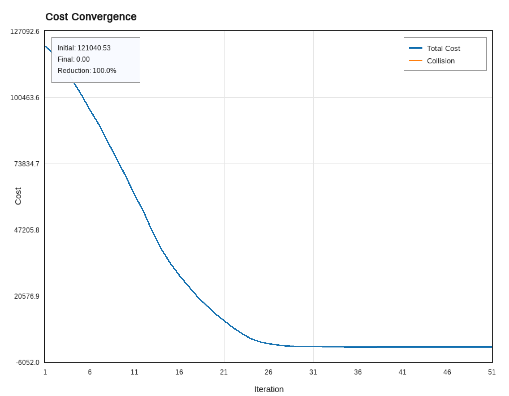

# ProxCEMP: Proximal Cross-Entropy Motion Planning

A high-performance C++ library for sampling-based trajectory optimization, featuring gradient-free algorithms for collision-free motion planning in N-dimensional configuration spaces.

---

## Table of Contents

- [Overview](#overview)
- [Key Features](#key-features)
- [Installation](#installation)
- [Quick Start](#quick-start)
- [Examples](#examples)
- [Algorithm Details](#algorithm-details)
- [Configuration Reference](#configuration-reference)
- [Project Structure](#project-structure)
- [Citation](#citation)
- [License](#license)

---

## Overview

ProxCEMP provides efficient, gradient-free optimization methods for trajectory planning in cluttered environments. The library implements a task-based architecture that cleanly separates optimization algorithms from problem-specific cost computations, enabling easy extension to new robot platforms and planning scenarios.

### Key Features

| Category | Features |
|----------|----------|
| **Algorithms** | Proximal Cross-Entropy Method (PCE), Natural Gradient Descent (NGD), STOMP, CasADi-based solvers |
| **Architecture** | Task-based design, header-only core, N-dimensional support, pluggable forward kinematics |
| **Collision Avoidance** | SDF-based detection, configurable safety margins, N-dimensional obstacles |
| **Trajectory Quality** | Smoothness optimization, configurable discretization, start/goal constraints |

---

## Installation

### Prerequisites

| Dependency | Version | Required |
|------------|---------|----------|
| C++ Compiler | C++17 (GCC 7+, Clang 5+, MSVC 2017+) | ✓ |
| CMake | 3.10+ | ✓ |
| Eigen3 | 3.3+ | ✓ |
| yaml-cpp | — | Optional |
| SFML | 3.0+ | Optional (visualization) |
| GoogleTest | — | Optional (testing) |
| nlohmann/json | 3.0+ | Optional (serialization) |

### Ubuntu/Debian

```bash
# Install dependencies
sudo apt-get update
sudo apt-get install -y \
    build-essential cmake libeigen3-dev \
    libyaml-cpp-dev libsfml-dev libgtest-dev nlohmann-json3-dev

# Clone and build
git clone --recurse-submodules https://github.com/hzyu17/ProxCEMP.git
cd ProxCEMP && mkdir build && cd build
cmake .. && make && sudo make install
```

#### For STOMP planner: an additional requirement for ASAN. Use the following flag:
```
cmake -DENABLE_STOMP_ASAN=ON ..
```

### macOS

```bash
# Install dependencies
brew install cmake eigen yaml-cpp sfml googletest nlohmann-json

# Clone and build
git clone --recurse-submodules https://github.com/hzyu17/ProxCEMP.git
cd ProxCEMP && mkdir build && cd build
cmake .. && make && sudo make install
```

---

## Quick Start

### Building Examples

```bash
cd Examples2d3d && mkdir build && cd build
cmake .. && make

# Run examples
./main                          # Compare optimization algorithms
./visualize_collision_checking  # Interactive collision visualization
./visualize_noisy_trj           # Smoothness noise distribution
```

### Minimal Configuration

```yaml
# config.yaml
experiment:
  random_seed: 999

environment:
  map_width: 800
  map_height: 600
  num_obstacles: 20
  obstacle_radius: 20.0

motion_planning:
  num_dimensions: 2
  num_discretization: 50
  start_position: [50.0, 550.0]
  goal_position: [750.0, 50.0]

pce_planner:
  num_samples: 3000
  num_iterations: 20
  temperature: 1.5
```

### Custom Task Implementation

```cpp
#include <task.h>

class MyCustomTask : public pce::Task {
public:
    float computeStateCost(const Trajectory& trajectory) const override {
        float cost = 0.0f;
        // Custom collision cost computation
        return cost;
    }
    
    bool filterTrajectory(Trajectory& trajectory, int iteration) override {
        // Optional: apply constraints (e.g., joint limits)
        return false;
    }
};
```

---

## Examples

### 2D Point Navigation

The library includes three visualization tools for 2D planning scenarios:

| Executable | Description | Key Controls |
|------------|-------------|--------------|
| `main` | Algorithm comparison (PCE, NGD, STOMP, CasADi) | Automatic execution |
| `visualize_collision_checking` | Interactive trajectory optimization | `SPACE`: optimize, `R`: reset, `C`: toggle spheres |
| `visualize_noisy_trj` | Smoothness noise distribution N(0, R⁻¹) | `S`: save PNG, `L`: toggle legend |

### Visualization Gallery

<p align="center">
  
  
</p>
<p align="center">
  <em>Left: Sampled trajectories from smoothness prior. Right: Collision status visualization.</em>
</p>

<!-- <p align="center">
  
  
</p>
<p align="center">
  <em>Cost convergence comparison between PCE and NGD algorithms.</em>
</p> -->

<p align="center">
  
  
</p>
<p align="center">
  <em>Optimization progression: PCE (left) vs NGD (right).</em>
</p>

<p align="center">
  
  
</p>
<p align="center">
  
  
</p>
<p align="center">
  <em>Optimization progression: Different Solvers in CasADi.</em>
</p>

<p align="center">
  
  
</p>
<p align="center">
  <em>3D trajectory visualization with interactive rotation and lighting.</em>
</p>

<p align="center">
  
  
</p>
<p align="center">
  <em>Optimization progression 3D: PCE (left) vs NGD (right).</em>
</p>

### ROS Integration

MoveIt integration is available at: [https://github.com/hzyu17/pce_ros](https://github.com/hzyu17/pce_ros)

<p align="center">
  
  
  
  
</p>
<p align="center">
  <em>Motion Planning for 7-DOF Robot Arm in various scenarios.</em>
</p>

---

## Algorithm Details

### Proximal Cross-Entropy Method (PCE)

PCE is a weighted sampling-based optimization method that iteratively refines trajectories through importance-weighted updates.

**Algorithm:**
1. Sample trajectories from smoothness prior: $\tilde{Y}_m \sim \mathcal{N}(Y_k, R^{-1})$
2. Evaluate collision costs: $S(\tilde{Y}_m)$
3. Compute importance weights: $w_m \propto \exp(-S(\tilde{Y}_m) / \tau)$
4. Update trajectory: $Y_{k+1} = \sum_m w_m \tilde{Y}_m$

**Parameters:**

| Parameter | Description | Recommended Range |
|-----------|-------------|-------------------|
| `num_samples` | Trajectory samples per iteration | 1000–5000 |
| `temperature` | Weight concentration (τ) | 0.5–2.0 |
| `eta` | Learning rate | 0.5–1.5 |
| `num_iterations` | Maximum iterations | 20–100 |

### Natural Gradient Descent (NGD)

NGD leverages the natural gradient of expected cost for efficient trajectory updates.

**Algorithm:**
1. Sample trajectories: $\tilde{Y}_m \sim \mathcal{N}(Y_k, R^{-1})$
2. Compute noise: $\epsilon_m = \tilde{Y}_m - Y_k$
3. Estimate natural gradient: $\nabla = \mathbb{E}[S(\tilde{Y})\epsilon]$
4. Update: $Y_{k+1} = (1-\eta)Y_k - \eta\nabla$

**Parameters:**

| Parameter | Description | Recommended Range |
|-----------|-------------|-------------------|
| `learning_rate` | Gradient step size (η) | 1e-4–1e-2 |
| `num_samples` | Samples for gradient estimation | 100–500 |
| `temperature` | Gradient scaling | 0.5–2.0 |

---

## Configuration Reference

### Environment Parameters

| Parameter | Description | Default |
|-----------|-------------|---------|
| `map_width`, `map_height` | Workspace dimensions | 800, 600 |
| `num_obstacles` | Number of obstacles | 20 |
| `obstacle_radius` | Obstacle size | 20.0 |
| `clearance_distance` | Minimum start/goal clearance | 100.0 |

### Cost Function Parameters

| Parameter | Description | Default |
|-----------|-------------|---------|
| `epsilon_sdf` | SDF collision threshold | 10.0 |
| `sigma_obs` | Collision cost weight | 10.0 |

### Motion Planning Parameters

| Parameter | Description | Default |
|-----------|-------------|---------|
| `num_dimensions` | Configuration space dimensions | 2 |
| `num_discretization` | Trajectory waypoints | 50 |
| `total_time` | Trajectory duration (s) | 10.0 |
| `node_collision_radius` | Safety margin per waypoint | 15.0 |

---

## Project Structure

```
ProxCEMP/
├── include/                          # Header-only library
│   ├── PCEMotionPlanner.h           # PCE algorithm
│   ├── NGDMotionPlanner.h           # NGD algorithm
│   ├── STOMPMotionPlanner.h         # STOMP algorithm
│   ├── CasadiMotionPlanner.h        # CasADi-based solvers
│   ├── MotionPlanner.h              # Base planner interface
│   ├── task.h                       # Task interface
│   ├── Trajectory.h                 # Trajectory representation
│   ├── ObstacleMap.h                # N-D obstacle management
│   ├── ForwardKinematics.h          # FK transformations
│   └── visualization.h              # SFML visualization
│
├── Examples2d3d/                       # 2D/3D planning examples
│   ├── src/                         # Example source files
│   ├── configs/                     # Configuration files
│   ├── figures/                     # Generated figures
│   └── tests/                       # Unit tests
│
├── Dockers/                          # Docker environments
│   └── ROS1MoveIt/                  # ROS MoveIt benchmarking
│
├── CMakeLists.txt
└── README.md
```

---

## Citation

If you use ProxCEMP in your research, please cite:

```bibtex
@article{proxcemp2025,
  title     = {ProxCEMP: Proximal Cross-Entropy Motion Planning},
  author    = {},
  journal   = {},
  year      = {2025},
  note      = {To appear}
}
```

---

## License

This project is licensed under the MIT License. See [LICENSE](LICENSE) for details.

---

## Related Work

- **STOMP**: Stochastic Trajectory Optimization for Motion Planning ([Kalakrishnan et al., 2011](https://ieeexplore.ieee.org/document/5980280))
- **CHOMP**: Covariant Hamiltonian Optimization for Motion Planning ([Ratliff et al., 2009](https://journals.sagepub.com/doi/10.1177/0278364913488805))
- **GPMP**: Gaussian Process Motion Planning ([Mukadam et al., 2018](https://journals.sagepub.com/doi/full/10.1177/0278364918790369?casa_token=M8AZHNAPmmgAAAAA%3AjJ5_Jc4Kta8W-ughIQNyxy7zzaEu8a7CVNEWocGyKpRQfSZ8NN7RrLQakIgBxtWYeH2BjvcrJoSe))
- **GVIMP**: Gaussian Variational Inference Motion Planning ([Yu et al., 2023](https://ieeexplore.ieee.org/abstract/document/10068240))
